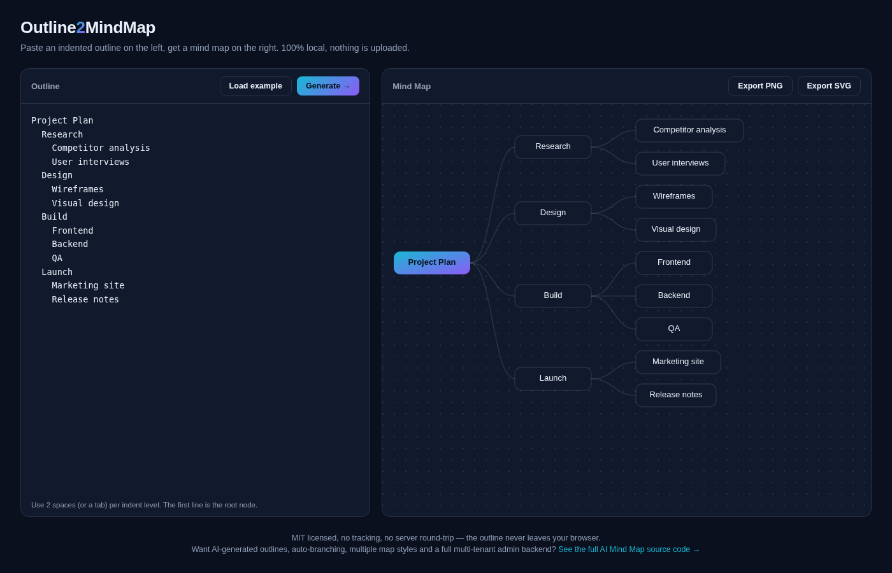

# 大纲转思维导图 · Outline2MindMap

**[在线体验 →](https://anna123123123-creator.github.io/outline2mindmap/)**

一个免费、开源、纯浏览器运行的小工具：把缩进文本大纲一键转换成可视化思维导图，支持导出 PNG / SVG。不用安装、不用注册、不需要后端、不做任何数据统计——大纲内容不会离开你的浏览器。



## 为什么做这个

大部分思维导图工具都要注册账号、要云端保存、甚至要订阅才能画几个方框连几条线。但很多时候你手上就是一份大纲（或者30秒就能写出一份），只想要一张干净的导图。这个工具就是干这个的。

## 试用方法

直接用浏览器打开 `index.html`，不需要构建、不需要装依赖。或者用任意静态文件服务器跑起来：

```bash
python3 -m http.server 8000
# 然后打开 http://localhost:8000
```

## 使用说明

1. 在左边输入或粘贴一份大纲，每一级用 2 个空格（或 1 个 Tab）缩进：
   ```
   项目计划
     调研
       竞品分析
       用户访谈
     设计
       线框图
   ```
2. 点击**生成**（第一次打开会自动加载示例）。
3. 点击**导出 PNG** 或**导出 SVG** 保存导图。

## 实现原理

纯文本大纲 → 解析成树结构 → 简单的从左到右树形布局算法，直接计算坐标并渲染成内联 SVG。没有用任何画图库或图表依赖，`script.js` 里大概 200 行原生 JavaScript。

## 协议

MIT，随便怎么用都行。

## 相关项目

这个工具是做一款完整的 **AI 思维导图**产品时顺手做的配套小工具——完整版支持一句话 AI 生成大纲、自动分支、多种导图样式、完整的多租户管理后台和会员算力体系。如果你需要的是这些而不是手动画图的小工具，完整源码在这：[全能源码 · AI 思维导图网站源码](https://inzyxuashop.com/aisiweidaotu-yuanma.html)。
